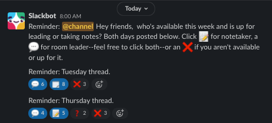

# Coffee Chats

Welcome to the Coffee docs! **Thank you all for supporting Virtual Coffee!**

> :triangular_flag_on_post: Hey - Just a friendly reminder that being a room leader/notetaker shouldn't be something that stresses you out. Every person in the room has the opportunity to contribute to the conversation and/or to add notes.

The goal for Coffees is to be part of a community and not to distance ourselves from it. These docs are to written with the intention of supporting our wonderful volunteers.

## Resources:

- [Icebreaker Topics](./icebreaker-topics.md): An ongoing list of potential topics for icebreakers.
- [Conversation Topics](./topic-suggestions.md): An ongoing list of potential topics for conversation starters.

## Roles:

### Hosts:

The host controls the role assignments and the breakout rooms. They monitor for members who show up late, and control when the rooms are opened and closed.

- [Host docs](./Hosts)

### MCs:

The MC gives the opening announcements and drops the important links into the chat.

- [MC docs](./MCs)

### Room Leaders:

The Room Leaders are the conversation facilitators of the breakout rooms. They give some instructions (handraise function), run the introductions, and make sure everyone is being heard. If no one has a topic, the room leader brings up the "backpocket" topic of choice.

- [Room Leader docs](./RoomLeaders-ConversationFacilitators)

### Note Takers:

Notetakers take notes on the conversation in the breakout rooms, grab the links that are dropped, and post the notes to slack after Coffee.

- [Notetaker docs](./Notetakers)

If you have any questions, feel free to ask in the slack channel or on the [discussion board](https://github.com/Virtual-Coffee/VC-Contributors/discussions). Since this is a discussion board for all teams, make sure to use the ☕ category and use @Virtual-Coffee/coffee-talk-team to notify the team in your post.

## Weekly Process

Each week on Monday morning at 6am PT / 7am MT / 8am CT / 9am ET a slackbot makes an `@channel` announcement in the [`#vc-room-leaders-notetakers`](https://virtual-coffee-group.slack.com/archives/G01GR1BGRL7) slack channel (times below are in North American Central Time):

```
Slackbot  8:00 AM
Reminder: @channel Hey friends,  who's available this week and is up for leading or taking notes? Both days posted below. Click :memo: for notetaker, a :speech_balloon: for room leader--feel free to click both--or an :x: if you aren't available or up for it.

8:01
Reminder: Tuesday thread.

8:02
Reminder: Thursday thread.
```

1. If you are available and willing to lead a room on either of those days add a  `:speech_bubble:` 💬

1. If you are available and willing to lead a room on either of those days add a  `:memo:` 📝

1. If you know for sure that you cannot make a session add a `:x:` ❌

NOTE:
- for the Tuesday thread please add your emojis on Mondays by 10am PT / 11am MT / 12pm noon CT / 1pm ET
- for the Thursday thread please add your emojis on Wednesdays by 10am PT / 11am MT / 12pm noon CT / 1pm ET

This gives the Hosts time to plan the rooms and assign volunteers to roles for each day.

Once we have volunteered for a slot it will look something like this in slack:

<p align="center">

</p>

Later that day the MC or Host for the week will post a list of Room Leader / Notetaker pairings.

### What happens if I am assigned a role and I can't make it?

Life happens and this community is here to support each other, so all we ask is that you communicate as your availability changes. 

If you have been assigned a role and at any time you learn that you will be unable to make it drop a message in the [`#vc-room-leaders-notetakers`](https://virtual-coffee-group.slack.com/archives/G01GR1BGRL7) and with a direct @ to the host as soon as you know so that the other volunteers can work out substitutions and coverage. For example, if Kirk is the host, post in the channel `@Kirk, something came up and I can't make today.`

If you are assigned as a room leader if needed, then the host may assign you to host a room without sending you a message. Things often get chaotic with last minute attendees coming in and the need to add a room quickly. If you want to double-check to make sure that it is, in fact, your room, the host has added a title to each of the rooms, which will appear at the top of the zoom screen.
