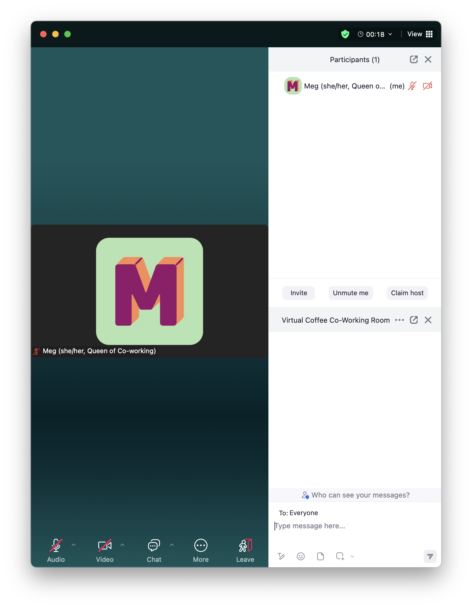
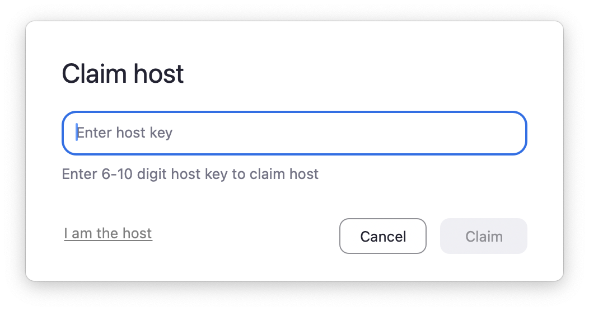
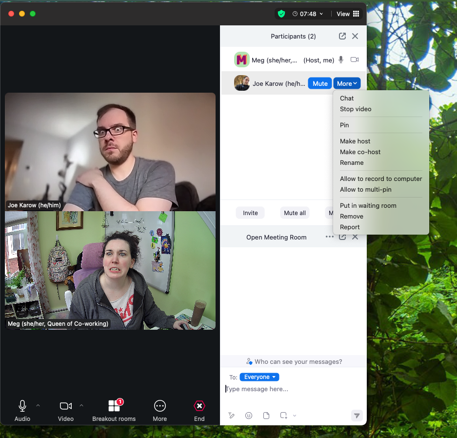
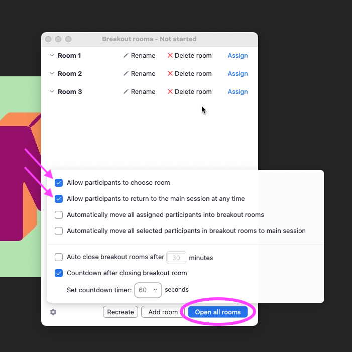
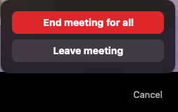

## Coffee Table Group Host Responsibilities

A Coffee Table Group Host facilitates a context-specific space for our current VC members. They set expectations for attendees by giving new members context when they join. Current Hosts describe the role as much like a Coffee Room Leader, but for a set focus area.

All Coffee Table Group Hosts are expected to represent the Virtual Coffee community and its mission by being welcoming and supportive to attendees, leading with kindness, and adhering to the [Code of Conduct](https://virtualcoffee.io/code-of-conduct).

### Handling Uncomfortable Situations

A disagreement could arise during a Coffee Table Group that you're hosting. In a wide-ranging community like ours, things like this happen from time to time. As a Coffee Table Group Host, you **are not** expected to play referee. Please instead [Report a Code of Conduct Violation](https://virtualcoffee.io/report-coc-violation) using our online form. If you have any lingering concerns after submitting the form, reach out to the [Events Maintainer](#events-maintainer).

### Promoting Your Coffee Table Group

It's recommended that you create a customized post to let VC members know that your Coffee Table group is beginning! Tell them what you'll be doing during the event and tag a few members who you think may be interested. Encourage asynchronous responses in a dedicated thread if people have a conflict and can't attend.

You can start a thread on the automated 'Starting Soon' post in the `#vc-events` channel or create an entirely new post. Boost your event in other relevant Slack channels as well for a broader reach.

:::danger[Important]

Do not post in the `#announcements` channel! This channel is reserved for news, updates, and automated posts to inform the Virtual Coffee community. `#vc-events` is meant for anything event-related. If you have any questions about this, please reach out to the [Events Maintainer](#events-maintainer).

:::

## Zoom Logistics

One of the many benefits of starting a Coffee Table group is that Virtual Coffee provides you with a Zoom room in which to host the event. As long as the Coffee Table group information is kept up to date (see [Coffee Table Groups](https://github.com/Virtual-Coffee/VC-Community-Docs/blob/6d722dceba508ecf8f583dedb3df3b1fb9fbde42/coffee-table-groups/coffee-table-groups.md) for the most up-to-date listings), your Zoom room should automatically start at the appropriate time and be accessible to all group Hosts and Leaders.

As a Coffee Table Group Host, you should have access to two private Slack channels: `#vc-events-admin` and `#vc-active-volunteers`. If you aren't in both of these channels, please contact the [Coffee Table Group Coordinator](#coffee-table-group-coordinator).

Your specific Coffee Table group may have their own Slack channel as well as additional Host instructions. If so, be sure to join the channel and read their guide!

Lastly, always remember to provide the following links in Zoom meetings: [Code of Conduct](https://virtualcoffee.io/code-of-conduct/) and [COC Violation Form](https://virtualcoffee.io/report-coc-violation/)

### Starting a Meeting

You may enter the Zoom up to 10 minutes before the start of the event. Do so by navigating to the `#vc-events-admin` channel in Slack and clicking the 'Join Event' button on the 'Starting Soon' event post.

### Claiming Host and Assigning Co-host

When you arrive in the Zoom, enter the Host Code to claim Host privledges. To do this, navigate to the `#vc-events-admin` channel in Slack and copy the Host Code from the posted Coffee Table group event.

Back in Zoom, open the Participants tab and click on the 'Claim host' button to input the code.

Once your Co-host enters the Zoom, hover over their name in the Participants tab and click the 'More ▿' button. Select the 'Make co-host' option to grant them Co-host privledges.

:::warning

As Zoom Host, if you leave the Zoom, you will end the call for all participants! If you have to leave early, be sure to pass Host privledges to your Co-host by following the steps above and selecting 'Make host' before exiting the Zoom call.

:::

### Creating Breakout Rooms

Some Coffee Table Groups utilize breakout rooms. If yours is one of those groups, read on to learn how to create breakout rooms.

Once you claim Host in Zoom, you'll see a 'Breakout rooms' tab. When you select this, a pop-up will appear with options. Be sure to select the following:

- Allow participants to choose room
- Allow participants to return to the main session at any time

Then, select the number of breakout rooms you want to create.

Don't forget to click on 'Open all rooms' when you're finished creating them!

### Ending a Meeting

Once your Coffee Table event has finished, click the 'End' button. This will trigger a pop-up where you'll select 'End meeting for all.'

:::warning[Caution]

Normally, it's okay if your Coffee Table meeting runs past your scheduled time – just make sure there isn't another VC event directly following yours. If that's the case, you can always ask the group to move to the `#co-working-room` to free up the Zoom for the next event.

:::

## Automated Event Messages

All Virtual Coffee events have automated messages attached to them:

| Message            | Slack Channel                 | When                                                          |
| ------------------ | ----------------------------- | ------------------------------------------------------------- |
| This Week's Events | `#announcements`              | Mondays at 8:00 AM local time                                 |
| Today's Events     | `#announcements`              | Every day with an event _except_ Monday at 8:00 AM local time |
| Starting Soon      | `#vc-events-admin`            | 10 minutes prior to the event                                 |
| Starting Soon      | `#vc-events` or other channel | 10 minutes prior to the event                                 |

- **This Week's Events:** An itinerary of the week's Virtual Coffee events, including event name, time, and in which Slack channel the join link will be posted (default `#vc-events`)
- **Today's Events:** A listing of that day's Virtual Coffee events, including event name, time, description, and in which Slack channel the join link will be posted (default `#vc-events`)
- **Starting Soon:** The content of this message changes depending on which Slack channel it's posted in
  - This message is usually posted in `#vc-events`, however, the Coffee Table Group Leader can elect to have it post to a different channel if they feel it's more appropriate to their Coffee Table Group. The content includes the event name, time, description, and a button that reads, 'Join Event,' which allows Virtual Coffee members to enter the event's Zoom room.
  - In addition, this message is always posted to `#vc-events-admin`. The content of this message includes the event name, time, location (Zoom URL), host code, and in which Slack channel the join link is posted. It also displays a 'Join Event' button for the Coffee Table Hosts and Leader to use.
  - The 'Join Event' buttons in both messages are identical, so a Coffee Table Host or Leader can use either one.

## Important Contacts

### Coffee Table Group Coordinator

**Currently Open!**

### Events Maintainer

Meg Gutshall (@meg-gutshall)
