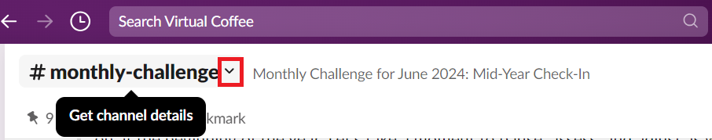
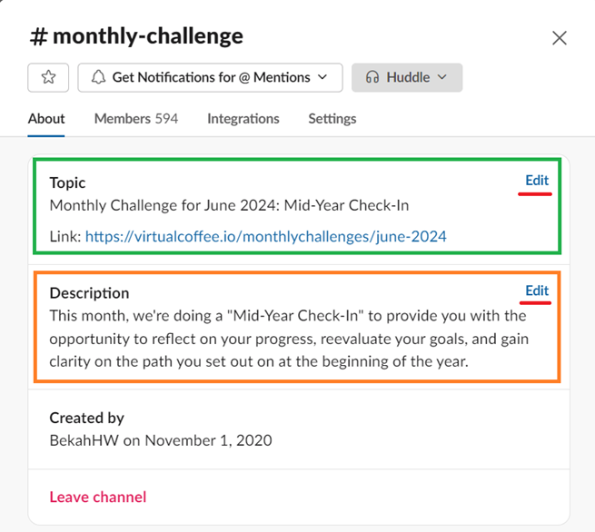
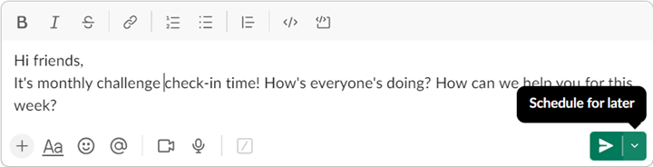
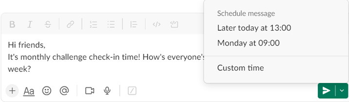

Monthly Challenge team communication and facilitation mostly takes place in Slack and GitHub. In this page, you will find a guide on how to work with Slack and update the website for the monthly challenge.

## Updating the `#monthly-challenge` Channel's Topic and Description on Slack

1. Click the down arrow next to the channel's name.

   

2. Click the "Edit" button in the topic section. Fill it in with the name of the challenge and the link to the challenge page on the website.
3. Click the "Edit" button in the description section. Fill it in with a brief description of the challenge.

   

## Setting Up a Slack Bot

You can set up a Slack bot to drop a reminder and schedule a thread from your personal account.

### Creating a Slack Reminder

Some challenges require regular reminders during the challenge that drops daily or weekly. You can read the guide on how to set a reminder on the official [Slack help center](https://slack.com/help/articles/208423427-Set-a-reminder).

### Scheduling a Thread

Sometimes, you want to write a customized thread directly from your account, such as weekly check-ins. If you need to post the thread in a particular hour, you can schedule it by following the below instructions on your desktop:

1. Go to the channel where you want to post your message.
2. Write your message.
3. Click the down arrow next to the green "Send" icon.

   

4. Select the "Custom time".
5. Set the day and time. This day and time default to your timezone.

   

## Updating the Monthly Challenge Pages on the Website

Even though most of our challenges remain the same as in previous years, we also create new challenges whenever there's a demand or when we feel it benefits our community. We make this information available on our Monthly Challenge pages.

Every month, we update these pages with the challenge's description and instructions on participating. Here is how to update the pages:

### Creating a new challenge page

1. Go to `src\app\monthlychallenges\(challenges)`.
2. Create a new folder for the challenge and follow previous challenges for the naming format. For example, `sept-2024`.
3. Create a `page.tsx` file in the folder.
4. Write the content.

:::note

- For repeated challenges, you can copy and paste the content from the past challenge's file and update it to fit the upcoming challenge.
- For a brand-new challenge, you need to write the content from scratch to introduce and describe it. However, you can use the format of any previous challenge.

:::

### Updating the monthly challenge landing page

1. Go to `src\app\monthlychallenges\page.tsx`.
2. Remove the `current: true` from the previous challenge and set it for the new challenge.
3. Update the link to the blog post. If there is no blog post, comment it out.
4. Update the link to the challenge page.
5. Update the link of the previous challenge.

Here is an example:

```javascript
{
  current: true,  // set for the new challenge
  title: 'Blogging Challenge',
  subtitle: `A Community Challenge to hit a word count goal for all our tech blogs.`,
  description: (
    <>
      <p>
        Based on the NaNoWriMo (National Novel Writing Month) Challenge, this
        challenge is the tech take on writing and working together towards the
        goal while posting on our own blogs.
      </p>
      // Update the link to a challenge blog post. If there is no blog post, comment out the paragraph.
      <p>
        Learn more about this challenge in{' '}
        <a href="https://dev.to/virtualcoffee/blogging-2023-monthly-challenge-3kng">
          this blog post
        </a>
        .
      </p>
      // Update the link to the new challenge page on the website
      <p>
        To view all of the details of this year's challenge,{' '}
        <Link to="/monthlychallenges/nov-2023">
          check out the November 2023 challenge page
        </Link>
        .
      </p>
    </>
  ),
  links: [
    // Add the link and title of the previous challenge
    {
      href: '/monthlychallenges/nov-2022',
      title: 'November, 2022',
    },
    {
      href: '/monthlychallenges/nov-2021',
      title: 'November, 2021',
    },
    {
      href: '/monthlychallenges/nov-2020',
      title: 'November, 2020',
    },
  ],
},
```

### Adding a success "completed challenge" alert to the previous challenge

1. Open the `page.tsx` file in the previous challenge folder.
2. Add the alert right on top of `<h1>`.
3. Update the link to the new challenge.

Here is an example:

```javascript
<div className="alert alert-success">
  This monthly challenge is complete. Congratulations! Please join us for the{' '}
  <Link to="/monthlychallenges/dec-2023">next challenge</Link>!
</div>
```
