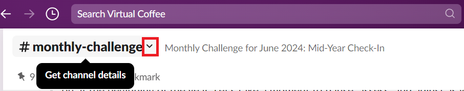
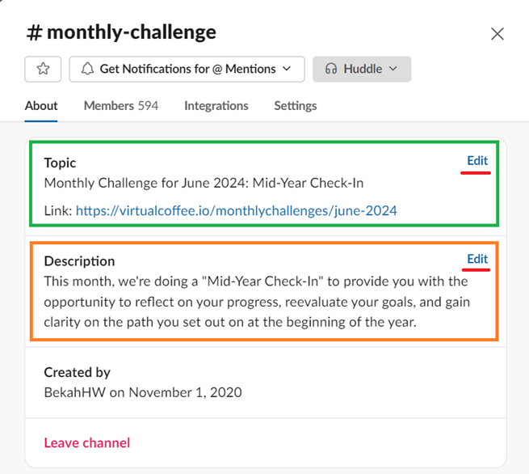
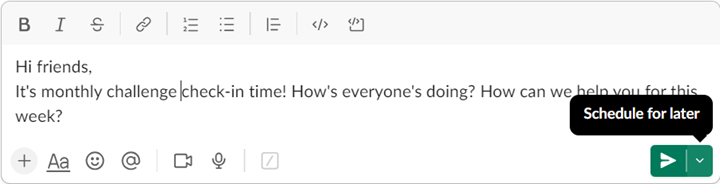
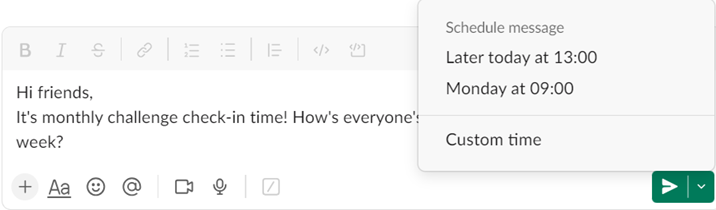

Monthly Challenge team communication and facilitation mostly takes place in Slack and GitHub. In this page, you will find a guide on how to work with Slack and update the website for the monthly challenge.

## Updating the `#monthly-challenge` Channel's Topic and Description on Slack

1. Click the down arrow next to the channel's name.

   

2. Click the "Edit" button in the topic section. Fill it in with the name of the challenge and the link to the challenge page on the website.
3. Click the "Edit" button in the description section. Fill it in with a brief description of the challenge.

   

## Setting Up a Slack Bot

You can set up a Slack bot to drop a reminder and schedule a thread from your personal account.

### Creating a Slack Reminder

Some challenges require regular reminders during the challenge that drops daily or weekly. You can read the guide on how to set a reminder on the official [Slack help center](https://slack.com/help/articles/208423427-Set-a-reminder).

### Scheduling a Thread

Sometimes, you want to write a customized thread directly from your account, such as weekly check-ins. If you need to post the thread in a particular hour, you can schedule it by following the below instructions on your desktop:

1. Go to the channel where you want to post your message.
2. Write your message.
3. Click the down arrow next to the green "Send" icon.

   

4. Select the "Custom time".
5. Set the day and time. This day and time default to your timezone.

   

## Updating the Monthly Challenge Pages on the Website

Even though most of our challenges remain the same as in previous years, we also create new challenges whenever there's a demand or when we feel it benefits our community. We make this information available on our Monthly Challenge pages.

Every month, we update these pages with the challenge's description and instructions on participating. Here is how to update the pages:

### Creating a new challenge page

1. Copy a previous challenge in `src/content/monthly-challenges/` (for example, `nov-2024.mdx`) to `<mon-year>.mdx`. The file name is the URL: `sept-2026.mdx` is `/monthlychallenges/sept-2026`.
2. Update the frontmatter:

   ```yaml
   ---
   meta:
     title: 'Monthly Challenge for September 2026: Preptember!'
     description: 'September challenge -> …'
   date: 2026-09-01
   series:
     - preptember
   ---
   ```

   `series` is the id of a file in `src/content/monthly-challenges/series/`. A challenge can belong to more than one series. For a season-long challenge, add `listTitle: Fall 2026` to override the default "September 2026" label.

3. Write the content in Markdown. Components such as `LeadText` are imported at the top of the file, as in the existing challenges.

:::note

- For repeated challenges, copy the past challenge's file and update it to fit the upcoming challenge.
- For a brand-new challenge, you need to write the content from scratch to introduce and describe it. However, you can use the format of any previous challenge.

:::

### Updating the monthly challenge landing page

The landing page is built from the challenge and series files, so most changes happen there:

- **Repeat challenge:** nothing to edit. Once the new file's `series` names the series, it becomes that series' "most recent challenge" link, and the previous one moves into the past-challenges list automatically.
- **Current challenge:** move `current: true` from the old series file to the new one.
- **Blog post link:** edit the series file's body. It's Markdown.
- **Brand-new challenge:** add `src/content/monthly-challenges/series/<id>.mdx` with `title`, `subtitle`, `order` (its position on the page), and the description as the body.

### Adding a success "completed challenge" alert to the previous challenge

1. Open the previous challenge's `.mdx` file in `src/content/monthly-challenges/`.
2. Add the alert right above the page heading.
3. Update the link to the new challenge.

Here is an example:

```mdx
<div className="alert alert-success">
  This monthly challenge is complete. Congratulations! Please join us for the
  [next challenge](/monthlychallenges/oct-2026)!
</div>
```
