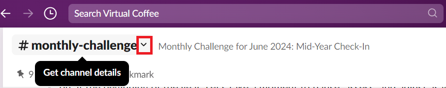
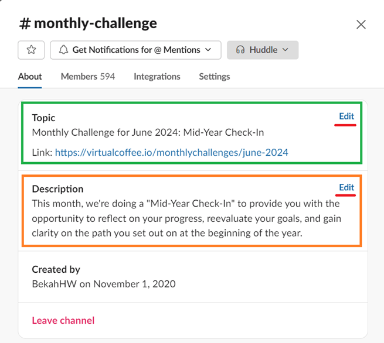
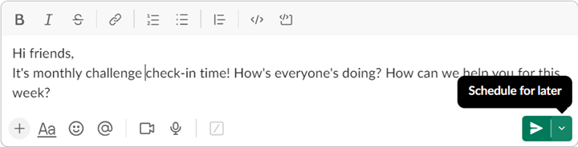
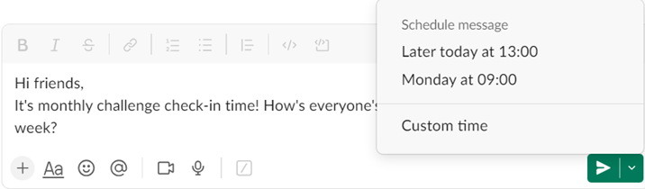

# Monthly Challenge Facilitators Handbook

Thanks for volunteering to facilitate our monthly challenges!

Most of our challenges have been created, and the directions and structure are available in the monthly challenge folders and on the website. The Monthly Challenge Team Leads and Community Maintainers are always here to answer your questions and support you, so please reach out anytime.

The Monthly Challenge Team abides by the Virtual Coffee [Code of Conduct](https://virtualcoffee.io/code-of-conduct/). Please take a moment to read it.

## Table of Contents

- [Facilitating a Challenge](#facilitating-a-challenge)
  - [Before the Challenge](#before-the-challenge)
    - [Coordinating with the Coffee Table Groups](#coordinating-with-the-coffee-table-groups)
    - [Updating the Challenge Pages on the Website](#updating-the-challenge-pages-on-the-website)
  - [The First Day of the Month](#the-first-day-of-the-month)
    - [Updating the `#monthly-challenge` Channel on Slack](#updating-the-monthly-challenge-channel-on-slack)
    - [Making an Announcement for a New Challenge](#making-an-announcement-for-a-new-challenge)
    - [Writing a Blog Post](#writing-a-blog-post)
  - [During the Challenge](#during-the-challenge)
  - [Post Challenge](#post-challenge)
- [Technical Guidelines](#technical-guidelines)
  - [Updating the `#monthly-challenge` Channel's Topic and Description on Slack](#updating-the-monthly-challenge-channels-topic-and-description-on-slack)
  - [Setting Up a Slack Bot](#setting-up-a-slack-bot)
    - [Creating a Slack Reminder](#creating-a-slack-reminder)
    - [Scheduling a Thread](#scheduling-a-thread)
  - [Updating the Monthly Challenge Pages on the Website](#updating-the-monthly-challenge-pages-on-the-website)
    - [1. Creating a new challenge page](#1-creating-a-new-challenge-page)
    - [2. Updating the monthly challenge landing page](#2-updating-the-monthly-challenge-landing-page)
    - [3. Adding a success "completed challenge" alert to the previous challenge](#3-adding-a-success-completed-challenge-alert-to-the-previous-challenge)

## Facilitating a Challenge

Let us know your availability for the challenge in the reminder thread that drops every mid-month in the `#vc-monthly-challenge-team` channel in Slack.

If you have ideas for a new challenge(s), you can propose and discuss them in the `#vc-monthly-challenge-team` channel on Slack or open a new [discussion on GitHub](https://github.com/Virtual-Coffee/VC-Community-Docs/discussions).

### Before the Challenge

#### Coordinating with the Coffee Table Groups

We love collaboration! We're happy to involve our [Coffee Table Groups](https://virtualcoffee.io/resources/virtual-coffee-handbook/guides-to-virtual-coffee/coffee-table-groups) in our challenges whenever possible. Besides giving more support to our community, our goal is that the community becomes more familiar with the Coffee Table Groups and can encourage them to attend the groups more and, ultimately, give them support through volunteering.

⏳ **Timeline**: When a challenge has been decided.

✅ **Tasks**:

- Reach out to the Coffee Table Group hosts, communicate about the upcoming challenge, and discuss how we can support each other during the challenge.

#### Updating the Challenge Pages on the Website

⏳ **Timeline**: Anytime before the challenge starts.

✅ **Tasks**:

- Change and adjust the challenge pages on the website to reflect the current challenge and create a PR. For instructions on updating the pages, see the "[Updating the Monthly Challenge Pages on the Website](#updating-the-monthly-challenge-pages-on-the-website)" section.

### The First Day of the Month

#### Updating the `#monthly-challenge` Channel on Slack

✅ **Tasks**:

- Change the `#monthly-challenge` channel topic and description in Slack. For the complete instructions, see the "[Updating the `#monthly-challenge` Channel's Topic and Description on Slack](#updating-the-monthly-challenge-channels-topic-and-description-on-slack)" section.

#### Making an Announcement for a New Challenge

✅ **Tasks**:

- Announce the challenge in the `#announcements` channel and crosspost it to the `#monthly-challenge` channel on Slack.

> [!NOTE]
> Each challenge file contains script templates for the announcement. If it is unavailable, you must write one and update the script template in the challenge file.

#### Writing a Blog Post

✅ **Tasks**:

- Drop the blog post about the challenge under the Virtual Coffee organization at [DEV](https://dev.to/virtualcoffee). Blog posts can be scheduled in advance.

> [!NOTE]
>
> - A blog post is optional. However, introducing and promoting our challenges to the public and our members through blog posts is one good way to engage the public in doing the challenge with us.
> - If you want to write a blog post about a challenge, please reach out to @BekahHW so you can be added to the Virtual Coffee organization on DEV.

### During the Challenge

Navigate to the [`monthly-challenges`](../monthly-challenges/) folder and read the README file in the challenge folder for complete instructions.

See the "[Setting Up a Slack Bot](#setting-up-a-slack-bot)" section to learn more about working with Slack during the challenge.

### Post Challenge

✅ **Tasks**:

- Provide feedback in the `#vc-monthly-challenge-team` channel, like what went well and what could've gone better for the challenge. Let us know what support you need and what things you think would be nice to do next time.
- Update the README file in the challenge's folder with:

  - new script templates and things we did for the challenge,
  - the month and year of the challenge,
  - the blog post(s) for the challenge, if any.

## Technical Guidelines

Monthly Challenge team communication and facilitation mostly takes place in Slack and GitHub. In this section, you will find a guide on how to work with Slack and update the website for the monthly challenge.

### Updating the `#monthly-challenge` Channel's Topic and Description on Slack

1. Click the down arrow next to the channel's name.

   

2. Click the "Edit" button in the topic section. Fill it in with the name of the challenge and the link to the challenge page on the website.
3. Click the "Edit" button in the description section. Fill it in with a brief description of the challenge.

   

### Setting Up a Slack Bot

You can set up a Slack bot to drop a reminder and schedule a thread from your personal account.

#### Creating a Slack Reminder

Some challenges require regular reminders during the challenge that drops daily or weekly. You can read the guide on how to set a reminder on the official [Slack help center](https://slack.com/help/articles/208423427-Set-a-reminder).

#### Scheduling a Thread

Sometimes, you want to write a customized thread directly from your account, such as weekly check-ins. If you need to post the thread in a particular hour, you can schedule it by following the below instructions on your desktop:

1. Go to the channel where you want to post your message.
2. Write your message.
3. Click the down arrow next to the green "Send" icon.

   

4. Select the "Custom time".
5. Set the day and time. This day and time default to your timezone.

   

### Updating the Monthly Challenge Pages on the Website

Even though most of our challenges remain the same as in previous years, we also create new challenges whenever there's a demand or when we feel it benefits our community. We make this information available on our Monthly Challenge pages.

Every month, we update these pages with the challenge's description and instructions on participating. Here is how to update the pages:

#### 1. Creating a new challenge page

- Go to `src\app\monthlychallenges\(challenges)`.
- Create a new folder for the challenge. Follow previous challenges for the naming format. For example, `sept-2024`.
- Create a `page.tsx` file in the folder.
- Write the content.

> [!NOTE]
>
> - For repeated challenges, you can copy and paste the content from the past challenge's file and update it to fit the upcoming challenge.
> - For a brand-new challenge, you need to write the content from scratch to introduce and describe the challenge. You can use the format of any previous challenge.

#### 2. Updating the monthly challenge landing page

- Go to `src\app\monthlychallenges\page.tsx`.
- Remove the `current: true` from the previous challenge and set it for the new challenge.
- Update the link to the blog post. If there is no blog post, comment it out.
- Update the link to the challenge page.
- Update the link of the previous challenge.

Here is an example:

```javascript
{
	current: true,  // set for the new challenge
	title: 'Blogging Challenge',
	subtitle: `A Community Challenge to hit a word count goal for all our tech blogs.`,
	description: (
		<>
			<p>
				Based off the NaNoWriMo (National Novel Writing Month) Challenge, this
				challenge is the tech take on writing and working together towards the
				goal while posting on our own blogs.
			</p>
			// Update the link to a challenge blog post. If there is no blog post, comment out the paragraph.
			<p>
				Learn more about this challenge in{' '}
				<a href="https://dev.to/virtualcoffee/blogging-2023-monthly-challenge-3kng">
					this blog post
				</a>
				.
			</p>
			// Update the link to the new challenge page on the website
			<p>
				To view all of the details of this year's challenge,{' '}
				<Link to="/monthlychallenges/nov-2023">
					check out the November 2023 challenge page
				</Link>
				.
			</p>
		</>
	),
	links: [
		// Add the link and title of the previous challenge
		{
			href: '/monthlychallenges/nov-2022',
			title: 'November, 2022',
		},
		{
			href: '/monthlychallenges/nov-2021',
			title: 'November, 2021',
		},
		{
			href: '/monthlychallenges/nov-2020',
			title: 'November, 2020',
		},
	],
},
```

#### 3. Adding a success "completed challenge" alert to the previous challenge

- Open the previous challenge file.
- Add the alert right on top of `<h1>`.
- Update the link to the new challenge.

Here is an example:

```javascript
<div className="alert alert-success">
  This monthly challenge is complete. Congratulations! Please join us for the{' '}
  <Link to="/monthlychallenges/dec-2023">next challenge</Link>!
</div>
```
